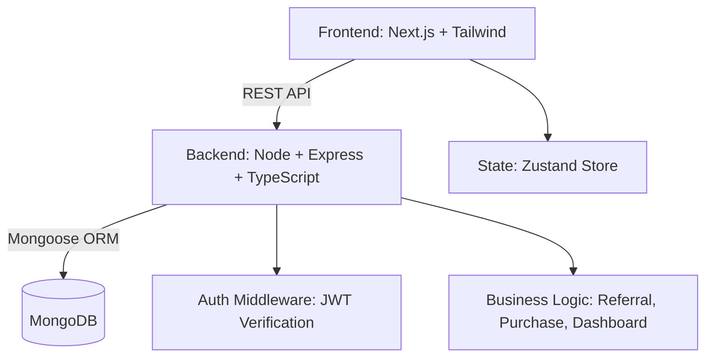

# 📘 Referral & Credit System — Full Stack Application

A full-stack **Referral and Credit Management System** built for the **FileSure Full Stack Developer Internship Assignment**.  
Users can register, share unique referral links, earn credits for referrals, simulate purchases, and track everything via a modern dashboard.

---

## 🚀 Features

### 👤 Authentication

- Secure user registration & login (JWT-based)
- Passwords hashed using bcrypt
- Protected routes with token-based authorization

### 🔗 Referral System

- Each user gets a **unique referral code**
- When a new user signs up with that code, a referral relationship is created
- On first purchase by the referred user, both earn **+2 credits**
- Prevents duplicate crediting

### 💳 Purchases

- “Buy Product” button simulates a purchase
- Only first purchase triggers referral credits

### 📊 Dashboard

- Displays total referrals, converted referrals, and total credits
- Copy/share referral link button
- Fully responsive design using Tailwind CSS

---

## 🧱 Tech Stack

| Layer                | Technology                                                 |
| -------------------- | ---------------------------------------------------------- |
| **Frontend**         | Next.js (TypeScript, Zustand, Tailwind CSS, Framer Motion) |
| **Backend**          | Node.js, Express.js, TypeScript                            |
| **Database**         | MongoDB + Mongoose                                         |
| **Auth**             | JWT (JSON Web Tokens)                                      |
| **Validation**       | Zod                                                        |
| **State Management** | Zustand                                                    |

---

## ⚙️ Architecture Diagram



---

## 📁 Folder Structure

### Backend

```
backend/
├── src/
│   ├── models/        # User, Referral, Purchase schemas
│   ├── routes/        # Express routes
│   ├── utils/         # JWT, Zod validation
│   └── server.ts      # Main entry file
├── scripts/
│   └── seed.js        # Seeds test users & referrals
└── package.json
```

### Frontend

```
frontend/
├── src/
│   ├── pages/         # Login, Register, Dashboard
│   ├── store/         # Zustand auth store
│   ├── lib/           # API calls
│   ├── styles/        # Tailwind globals
│   └── components/    # UI Components
└── package.json
```

---

## 🔧 Setup Instructions

### 1️⃣ Backend Setup

```bash
cd backend
npm install
```

Create `.env`:

```
PORT=4000
MONGO_URI=mongodb+srv://<username>:<password>@cluster0.mongodb.net/filesure?retryWrites=true&w=majority
JWT_SECRET=supersecretkey
JWT_EXPIRES_IN=7d
```

Run server:

```bash
npm run dev
```

### 2️⃣ Frontend Setup

```bash
cd ../frontend
npm install
```

Create `.env.local`:

```
NEXT_PUBLIC_API_URL=http://localhost:4000
```

Run:

```bash
npm run dev
```

Visit: [http://localhost:3000](http://localhost:3000)

---

## 🧪 Testing Flow

1. Register User A (Lina) — get referral code
2. Register User B (Ryan) — use ?r=LINA_CODE
3. Login as Ryan → Buy product
4. Login as Lina → See credits & stats in dashboard

---

## 💾 Seeding Test Data

```bash
cd backend
npx ts-node scripts/seed.js
```

Creates:
| User | Email | Password |
|-------|--------|-----------|
| Lina | lina@example.com | 123456 |
| Ryan | ryan@example.com | 123456 |

---

## 🧩 API Endpoints

| Method | Endpoint             | Description           |
| ------ | -------------------- | --------------------- |
| POST   | `/api/auth/register` | Register new user     |
| POST   | `/api/auth/login`    | Login & get JWT       |
| POST   | `/api/purchase`      | Simulate a purchase   |
| GET    | `/api/dashboard`     | Fetch dashboard stats |

---

## 📈 Evaluation Highlights (FileSure Criteria)

| Category              | Weight | Implementation                              |
| --------------------- | ------ | ------------------------------------------- |
| Frontend (UI/UX)      | 40%    | Modern responsive design, Tailwind, Zustand |
| Backend (API & Logic) | 40%    | TypeScript, Zod, clean structure            |
| Documentation         | 20%    | Detailed README, UML, setup guide           |
| Bonus                 | +10%   | JWT Auth, animations, deployment-ready      |

---

## 🧠 Author

**Suraj Gholase**  
Full Stack Developer — MERN / Android / Java  
📧 surajgholase41@gmail.com

---

## 🏁 License

This project is part of the **FileSure Internship Assignment** and may be reused for educational purposes.
